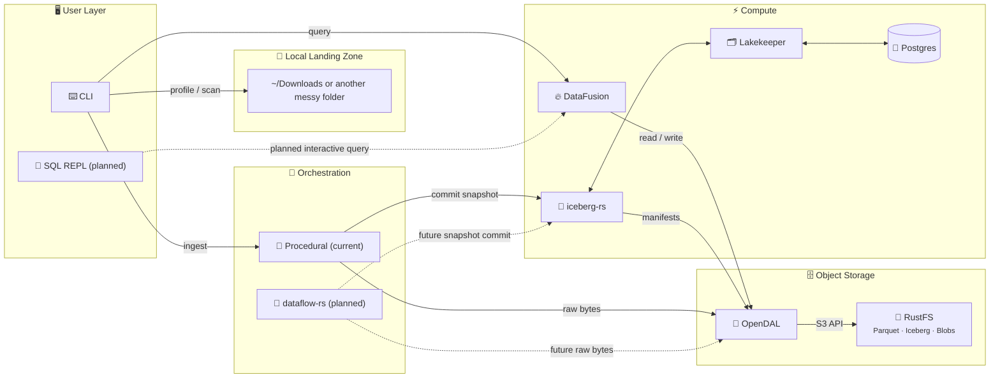

# Anti-Entropator

[](https://github.com/sm4rtm4art/anti_entropator/actions/workflows/ci.yml)
[](https://codecov.io/gh/sm4rtm4art/anti_entropator)
[](LICENSE)
[](https://www.rust-lang.org)

_Fighting entropy, one file at a time._

**A local-first Rust CLI that turns an unstructured pile of files into a
queryable, Iceberg-backed data lakehouse — on one machine, with no JVM and no
cloud account.**

Point it at a messy directory. Anti-Entropator profiles what is there, enriches
file metadata, uploads selected files to content-addressed object storage,
commits catalog rows as an Iceberg snapshot, and answers questions with SQL.

```bash
anti_entropator profile ~/Downloads
anti_entropator ingest  ~/Downloads --include '*.pdf'
anti_entropator query   "SELECT category, COUNT(*) FROM iceberg.anti_entropator.file_catalog GROUP BY category"
```

> **Status — early public preview (v0.3 stabilization, updated 2026-07).**
> The `profile → scan → ingest → query` path works end to end today. `sql`,
> `duplicates`, and `merge` are declared placeholders and exit non-zero rather
> than pretending to succeed. Release hardening is being finished in small,
> reviewable slices.

---

## Why this exists

The problem is small on a laptop and large in an organization: exports,
reports, media, and intermediate artifacts pile up faster than anyone catalogs
them. `~/Downloads` is the reference workload because it is the most familiar
version of that swamp — the same shape as the terabyte-scale dumps data teams
inherit, just small enough to reason about completely.

The origin is more modest. My very first project was a Python script with `glob`
and a lot of optimism to clean my Downloads folder. This is the same problem revisited with more experience
and a deliberately serious toolchain. It is overbuilt for a downloads folder on
purpose: the goal is to exercise real lakehouse patterns end to end — content
addressing, catalog commits, snapshot semantics, query federation — and to keep
every claim about them honest.

## What works today

| Command      | Status  | What it does                                                    |
| ------------ | ------- | --------------------------------------------------------------- |
| `profile`    | Ready   | Read-only directory analysis. No Docker, no writes.               |
| `doctor`     | Ready   | Preflight checks for Docker, endpoints, credentials, CLI tools.   |
| `up`         | Ready   | Verify the lakehouse services are reachable.                      |
| `init`       | Ready   | Create bucket, Lakekeeper project/warehouse, namespace, table.    |
| `scan`       | Ready   | Metadata enrichment without uploading anything.                   |
| `ingest`     | Ready   | Upload to object storage and commit metadata to Iceberg.          |
| `query`      | Ready   | One-shot SQL over the catalog via DataFusion.                     |
| `sql`        | Planned | Interactive SQL REPL. Placeholder; exits non-zero.                |
| `duplicates` | Planned | Duplicate management workflow. Placeholder; exits non-zero.       |
| `merge`      | Planned | Ingest branch merge workflow. Placeholder; exits non-zero.        |

What the ready path gives you:

- **Cataloging** with rich metadata: type, size, SHA-256 hash, MIME type.
- **Content-addressed storage**, so identical files deduplicate naturally and
  re-ingesting unchanged input uploads nothing.
- **Optional enrichment** through `ffprobe`, `exiftool`, and `pdfinfo` when
  those tools are installed.
- **Iceberg snapshots** for every ingest, with schema evolution and time travel
  available from the table format.
- **SQL** over the result, using the same storage boundary the writer uses.

## Architecture

Solid lines are implemented today. Dashed lines are planned.



Every object-store read, write, list, head, and delete goes through a single
OpenDAL boundary — including DataFusion's, via `object_store_opendal`. That
constraint is what keeps the writer and the query engine from drifting into two
different views of storage.

### Technology choices

Each choice has an Architecture Decision Record explaining the alternatives that
were rejected and why.

| Layer          | Choice                | Rationale                                                              |
| -------------- | --------------------- | ---------------------------------------------------------------------- |
| Language       | Rust                  | Single static binary, predictable memory, no runtime ([ADR-001](docs/adr/ADR-001-rust-language.md)) |
| Object store   | [RustFS](https://github.com/rustfs/rustfs) | S3-compatible, Apache-2.0, Rust ([ADR-002](docs/adr/ADR-002-rustfs-object-storage.md)) |
| Table format   | [Apache Iceberg](https://iceberg.apache.org/) | Snapshots, schema evolution, time travel ([ADR-003](docs/adr/ADR-003-iceberg-table-format.md)) |
| Catalog        | [Lakekeeper](https://github.com/lakekeeper/lakekeeper) | Iceberg REST catalog in Rust, Postgres-backed, no JVM ([ADR-004](docs/adr/ADR-004-lakekeeper-catalog.md)) |
| Query engine   | [DataFusion](https://datafusion.apache.org/) | Embedded Arrow SQL engine, reads Iceberg in-process ([ADR-005](docs/adr/ADR-005-datafusion-query-engine.md)) |
| I/O boundary   | [OpenDAL](https://opendal.apache.org/) | One abstraction for all object-store operations ([ADR-006](docs/adr/ADR-006-opendal-unified-io.md)) |
| Orchestration  | Procedural today      | DAG execution via dataflow-rs is planned, not shipped ([ADR-007](docs/adr/ADR-007-dataflow-rs-orchestration.md)) |
| Delivery       | Docker Compose        | One-command local stack; release path documented in [ADR-008](docs/adr/ADR-008-release-grade-ci-cd-delivery.md) |

The whole stack is Rust or Rust-friendly by design: no JVM, no Spark, no
Kubernetes required to run it.

## Quick start

The `Makefile` is a thin wrapper over the underlying `cargo` and
`docker compose` commands. Run `make help` for the full list.

### 1. Profile a folder (no Docker needed)

```bash
make profile
```

```text
═══════════════════════════════════════════════════════════════
  📊 Anti-Entropator Swamp Profile
═══════════════════════════════════════════════════════════════

  Path: /Users/you/Downloads
  Files: 4,548 | Dirs: 111 | Total size: 4.49 GiB

─── By Extension (top 25 by total size) ───────────────────────
╭───────────┬───────┬───────────┬──────────┬───────────╮
│ Extension │ Count │ Total     │ Avg      │ Max       │
├───────────┼───────┼───────────┼──────────┼───────────┤
│ .mp4      │ 811   │ 2.05 GiB  │ 2.59 MiB │ 53.81 MiB │
│ .pdf      │ 465   │ 1.11 GiB  │ 2.44 MiB │ 99.66 MiB │
...
```

### 2. Start the lakehouse stack

```bash
make setup    # creates .env from env.example and prepares local directories
              # edit .env and replace every CHANGE_ME value before continuing
make up       # start RustFS, Lakekeeper, and Postgres
make doctor   # verify health and preflight requirements
```

### 3. Initialize the lakehouse

```bash
make init
```

This creates or verifies the RustFS bucket, the Lakekeeper project and
warehouse, the Iceberg namespace, and the `file_catalog` table.

### 4. Scan and ingest

```bash
make scan            # enrich metadata, read-only
make ingest-dry-run  # preview exactly what would be uploaded
make ingest          # upload to RustFS and commit to Iceberg
```

### 5. Query

The catalog table is the Iceberg table `file_catalog`, fully qualified as
`iceberg.anti_entropator.file_catalog`. The `query` command also accepts `files`
as shorthand in `FROM` and `JOIN` clauses and rewrites it to the qualified name.

```bash
make query QUERY="SELECT category, COUNT(*) FROM iceberg.anti_entropator.file_catalog GROUP BY category"

# shorthand, equivalent to the above
make query QUERY="SELECT category, COUNT(*) FROM files GROUP BY category"
```

Point any target at a different folder with `DOWNLOADS=/path/to/folder`, for
example `make profile DOWNLOADS=~/Desktop`.

## Engineering practices

This is a showcase project, so the process is part of what is on display.

- **Stabilization blocks over big-bang releases.** v0.3 work runs as small,
  PR-sized blocks — correctness fixes, test pyramid, secrets and auth
  hardening, technical-debt audit, CI/CD delivery — each with a named quality
  gate and recorded validation evidence before it merges.
- **Tests are the release floor.** 222 unit tests and 32 CLI tests pass on every
  change, plus two Docker-backed `init → ingest → query` tests run on demand
  against the local stack. CI fails the build below 50% line coverage.
- **Everything checkable is checked automatically.** `cargo fmt`,
  `clippy -D warnings`, tests, coverage, `cargo audit`, Trivy filesystem and
  image scanning with a fixable HIGH/CRITICAL gate, `zizmor` workflow analysis,
  and Markdown/shell linting all run in GitHub Actions. Third-party actions are
  SHA-pinned. Pre-commit and pre-push hooks catch the same failures locally.
- **Decisions are written down.** Eight ADRs record the reasoning, including
  what was rejected: MinIO, Nessie, DuckDB, and anything requiring a JVM.
- **Honest documentation is a hard rule.** Placeholder commands fail loudly,
  planned work is labeled planned, and every security control is classified as
  enforced today, human-verified, or planned.

## Scope and limits

- **Deployment scope is a single-developer local demo** via Docker Compose.
  Compose services bind to `127.0.0.1` and the default credentials are
  development-only.
- **CI publishes container images** for release and reference use. A shared or
  public deployment needs its own threat model, non-local auth, managed
  secrets, and network review — see [docs/security](docs/security/).
- **Not implemented yet:** interactive SQL, duplicate management, ingest branch
  merge, Iceberg maintenance primitives (`expire`, `vacuum`), and dataflow-rs
  orchestration. All are tracked in the [roadmap](docs/ROADMAP-v0.3.0.md).
- **Blue/green delivery is a documented simulation**, not production
  automation. It is labeled as such wherever it appears.

## Documentation

| Topic | Document |
| ----- | -------- |
| Install and first run | [Getting Started](docs/manual/getting-started.md) |
| System design | [Architecture](docs/design/architecture.md) |
| Technology decisions | [ADRs](docs/adr/) |
| Release plan | [Roadmap v0.3.0](docs/ROADMAP-v0.3.0.md) |
| Contributing | [CONTRIBUTING.md](CONTRIBUTING.md) |
| Vulnerability reporting | [SECURITY.md](SECURITY.md) |
| Secrets handling | [Secrets and .env Handling](docs/security/secrets-management.md) |
| Deployment boundaries | [Deployment Security Profiles](docs/security/deployment-profiles.md) |
| Container hardening | [Docker and CI Hardening Review](docs/security/docker-hardening-review.md) |
| Delivery model | [Blue-Green Delivery](docs/ci-cd/blue-green-delivery.md) |

## License

MIT — see [LICENSE](LICENSE).
