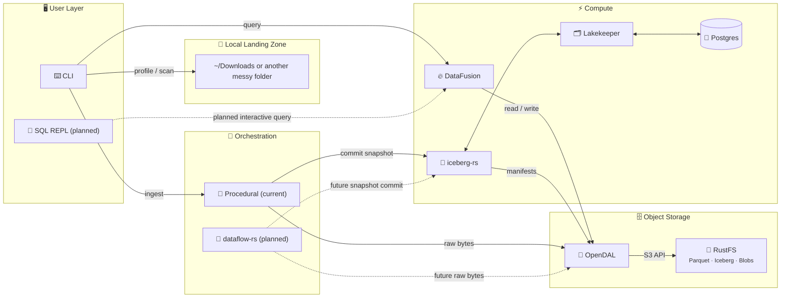

# Anti-Entropator

[](https://github.com/sm4rtm4art/anti_entropator/actions/workflows/ci.yml)
[](https://codecov.io/gh/sm4rtm4art/anti_entropator)
[](LICENSE)
[](https://www.rust-lang.org)

## **🚧 Early Public Preview / Work in Progress 🚧**

(State: v0.3 stabilization, updated 2026-05-21)

> Anti-Entropator is public early so evaluation and collaboration can happen
> while v0.3 stabilization is still in progress. The local profiling, scanning,
> ingest, and one-shot query workflows are usable today. Some commands are still
> placeholders, and release/security hardening is being finished in small,
> reviewable slices.
----

## The Anti-Entropator <br> _Fighting entropy, one file at a time_

A **local-first Rust CLI** for turning a messy folder into a queryable,
Iceberg-backed data lakehouse.

The test environment is intentionally ordinary: the notorious cluttered
`~/Downloads` folder. It is a small, familiar version of a problem many teams
recognize at a larger scale: terabytes or petabytes of files, exports, reports,
media, and intermediate artifacts with no reliable structure around them.

The personal origin story is even smaller. My first Python project tried to
organize my downloads folder with a script, `glob`, and a lot of optimism. This
project revisits the same problem with more experience and, deliberately, a
much more serious toolchain. It is overbuilt on purpose: a showcase for Rust,
lakehouse patterns, local-first operations, and open-source documentation, while
still returning something practical to anyone with a messy file dump.

The CI/CD and blue/green delivery notes point toward a larger operational shape,
but the current default remains local. RustFS, Iceberg, Lakekeeper, OpenDAL, and
DataFusion are used because they make the local workflow look like a small
version of systems that could grow toward hybrid on-prem/cloud data management.
That scalability story is an architectural direction, not a production claim.

### Anti-Entropator treats that dump like data

- profile it without Docker or writes;
- scan and enrich file metadata;
- ingest selected files into RustFS-backed object storage;
- commit catalog metadata through Lakekeeper/Iceberg;
- query the catalog with DataFusion SQL.

It is a showcase project, but the showcase is meant to stay honest: local-first
lakehouse patterns, Rust systems engineering, and careful stabilization before
claiming production readiness.

## Architecture

This diagram is intentionally split between **current** behavior and planned
expansion points. Solid lines are implemented today. Dashed lines are planned.



> **Current truth:** OpenDAL is the I/O boundary, RustFS is the object store,
> Lakekeeper is the Iceberg REST catalog, and DataFusion powers one-shot
> queries. Interactive SQL and DAG orchestration remain planned work.

## Current Scope

This scope may still evolve while v0.3 stabilization progresses.

### What works today

- `profile`: read-only directory analysis, no Docker required.
- `doctor` and `up`: local stack and preflight checks.
- `init`: RustFS bucket, Lakekeeper project/warehouse, namespace, and Iceberg
  table setup.
- `scan`: metadata enrichment without uploading.
- `ingest`: object upload plus Iceberg metadata commit.
- `query`: one-shot DataFusion SQL over the registered catalog data.

### What is intentionally not finished yet

- `sql`: interactive SQL REPL placeholder.
- `duplicates`: duplicate management workflow placeholder.
- `merge`: ingest branch merge workflow placeholder.
- `dataflow-rs` orchestration: planned/targeted, not the default runtime path.
- release-grade deployment hardening: in progress as part of S5 stabilization.

### Current deployment scope

- The default profile is **single-developer local demo**.
- GitHub Actions currently use `GITHUB_TOKEN` for GHCR publishing; no persistent
  external deployment secrets are required yet.
- Shared or public deployments need a separate threat model, non-local auth,
  managed secrets, and reviewed network exposure.

## Why the Downloads Folder Scope?

Your downloads folder is a data swamp. This project turns it into something
observable and queryable by:

- **Cataloging** every file with rich metadata (type, size, hash, MIME)
- **Detecting duplicates** via content hashing
- **Enriching** files with optional external tools (`ffprobe`, `exiftool`, `pdfinfo`)
- **Persisting** selected files and metadata in a lakehouse-shaped local stack
- **Querying** the catalog with SQL

## Database-Centered Systems Inspiration

Projects in the DBOS space are exploring a much stronger idea: make the database
a core execution and state substrate for an operating system or runtime. That is
interesting because it treats durable, queryable state as an organizing
principle rather than a passive storage detail.

Anti-Entropator is a small application-level proof of concept in that spirit,
not an operating system and not an implementation of DBOS. It asks a humbler
question: what if a familiar mess, like a Downloads folder, was treated as
structured operational data? In this project, the database/lakehouse layer is
the place where file metadata, object placement, and query behavior become
explicit instead of being scattered across filenames, folders, and memory.

## Quick Start

The `Makefile` is a thin wrapper around the underlying `cargo` and
`docker compose` commands. Use `make help` to see the full command list.

### 1. Profile your downloads (no Docker needed)

```bash
make profile
```

Output:

```text
═══════════════════════════════════════════════════════════════
  📊 Anti-Entropator Swamp Profile
═══════════════════════════════════════════════════════════════

  Path: /Users/you/Downloads
  Files: 4,548 | Dirs: 111 | Total size: 4.49 GiB

─── By Extension (top 25 by total size) ───────────────────────
╭───────────┬───────┬───────────┬──────────┬───────────╮
│ Extension │ Count │ Total     │ Avg      │ Max       │
├───────────┼───────┼───────────┼──────────┼───────────┤
│ .mp4      │ 811   │ 2.05 GiB  │ 2.59 MiB │ 53.81 MiB │
│ .pdf      │ 465   │ 1.11 GiB  │ 2.44 MiB │ 99.66 MiB │
...
```

### 2. Start the lakehouse stack

```bash
# Create .env from env.example if missing and prepare local directories
make setup

# Edit .env and replace all CHANGE_ME values before starting services

# Start services
make up

# Verify health
make doctor
```

### 3. Initialize the lakehouse

```bash
make init
```

This creates or verifies the RustFS bucket, Lakekeeper project and warehouse,
Iceberg namespace, and `file_catalog` table.

### 4. Scan and ingest files

```bash
# Scan & enrich metadata (read-only)
make scan

# Preview what will be ingested
make ingest-dry-run

# Ingest files: uploads to RustFS + commits metadata to Iceberg table
make ingest
```

### 5. Query the catalog

```bash
make query QUERY="SELECT category, COUNT(*) FROM file_catalog GROUP BY category"
```

To point the workflow at another folder, pass `DOWNLOADS=/path/to/folder` to the
Make target, for example `make profile DOWNLOADS=~/Desktop`.

## Features

| Feature      | Status | Description                                      |
| ------------ | ------ | ------------------------------------------------ |
| `profile`    | ✅      | Read-only directory analysis                     |
| `doctor`     | ✅      | Stack health and preflight checks                |
| `up`         | ✅      | Verify lakehouse services are reachable          |
| `init`       | ✅      | Initialize bucket, warehouse, namespace, table   |
| `scan`       | ✅      | Metadata enrichment without uploading            |
| `ingest`     | ✅      | Upload files and commit metadata to Iceberg      |
| `query`      | ✅      | One-shot SQL queries via DataFusion              |
| `sql`        | 🚧      | Interactive SQL REPL placeholder                 |
| `duplicates` | 🚧      | Duplicate finder workflow placeholder            |
| `merge`      | 🚧      | Ingest branch merge workflow placeholder         |

**Legend:** ✅ Implemented | 🚧 Placeholder or planned

## Stack Components

- **[RustFS](https://github.com/rustfs/rustfs)**: S3-compatible object storage (Apache 2.0)
- **[Lakekeeper](https://github.com/lakekeeper/lakekeeper)**: Apache Iceberg REST Catalog (Rust)
- **[Apache Iceberg](https://iceberg.apache.org/)**: Table format with time travel
- **[DataFusion](https://datafusion.apache.org/)**: SQL query engine
- **[OpenDAL](https://opendal.apache.org/)**: Unified storage I/O boundary
- **[dataflow-rs](https://github.com/dataflow-rs/dataflow-rs)**: Optional DAG-based orchestration engine (planned v0.3.0)

## Quality and Security Posture

- CI runs Rust formatting, linting, tests, coverage, and container/release
  checks in separate workflows.
- Security checks include dependency audit, Trivy visibility, pinned GitHub
  Actions, `zizmor`, CodeQL/secret-scanning repository settings, and runner
  cleanup.
- Documentation and shell quality checks are being added as part of S5 CI
  hygiene work.
- Known hardening exceptions and deployment boundaries are tracked in the
  security docs rather than hidden in the README.

## Documentation

- [Getting Started](docs/manual/getting-started.md)
- [Architecture](docs/design/architecture.md)
- [Security Policy](SECURITY.md)
- [Secrets and .env Handling](docs/security/secrets-management.md)
- [Go-Public Security Checklist](docs/security/go-public-checklist.md)
- [Deployment Security Profiles](docs/security/deployment-profiles.md)
- [Docker and CI Hardening Review](docs/security/docker-hardening-review.md)
- [Blue-Green Delivery Model](docs/ci-cd/blue-green-delivery.md)
- [ADRs](docs/adr/) - Why we made these technology choices
- [Roadmap v0.3.0](docs/ROADMAP-v0.3.0.md) - Upcoming features and milestones

## Project Goals

1. **Clean my downloads folder** - Practical utility
2. **Learn Rust deeply** - Systems programming skills
3. **Demonstrate lakehouse patterns** - Portfolio piece
4. **Teach others** - Good documentation

## License

MIT
