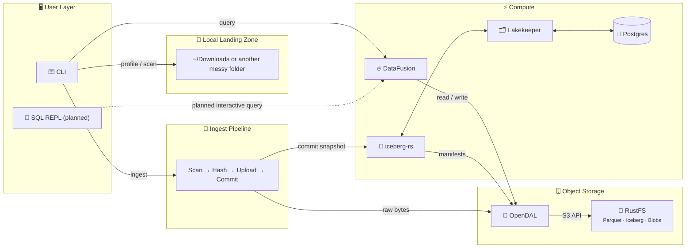

# Anti-Entropator

[](https://github.com/sm4rtm4art/anti_entropator/actions/workflows/ci.yml)
[](https://codecov.io/gh/sm4rtm4art/anti_entropator)
[](LICENSE)
[](https://www.rust-lang.org)

_Fighting entropy, one file at a time._

**A local-first Rust CLI that turns an unstructured pile of files into a
queryable, Iceberg-backed data lakehouse — on one machine, with no JVM and no
cloud account.**

Point it at a messy directory. Anti-Entropator profiles what is there, enriches
file metadata, uploads selected files to content-addressed object storage,
commits catalog rows as an Iceberg snapshot, and answers questions with SQL.

```bash
anti_entropator profile ~/Downloads
anti_entropator ingest  ~/Downloads --include '*.pdf'
anti_entropator query   "SELECT category, COUNT(*) FROM iceberg.anti_entropator.file_catalog GROUP BY category"
```

> **Status: v0.3.1, early public preview.** The `profile → scan → ingest →
> query` path works end to end. Ingest is idempotent and recoverable: re-running
> on unchanged input uploads nothing, and an interrupted run is reconciled by
> the next one. The binary contains only implemented commands; see
> [Scope and limits](#scope-and-limits) for what is not there yet.

---

## Why this exists

Exports, reports, media, and intermediate artifacts accumulate faster than
anyone catalogs them. The problem is the same on a laptop and in an
organization; only the volume differs. `~/Downloads` is the reference workload
because it has the shape of the large, unstructured dumps data teams inherit,
at a size that can be reasoned about completely.

Anti-Entropator applies the lakehouse pattern to that workload end to end:
content-addressed storage, an Iceberg table as the catalog, snapshot semantics
for every ingest, and SQL over the result, all from a single binary against a
local Docker Compose stack.

## What works today

| Command      | Status  | What it does                                                    |
| ------------ | ------- | --------------------------------------------------------------- |
| `profile`    | Ready   | Read-only directory analysis. No Docker, no writes.               |
| `doctor`     | Ready   | Preflight checks for Docker, endpoints, credentials, CLI tools.   |
| `up`         | Ready   | Verify the lakehouse services are reachable.                      |
| `init`       | Ready   | Create bucket, Lakekeeper project/warehouse, namespace, table.    |
| `scan`       | Ready   | Metadata enrichment without uploading anything.                   |
| `ingest`     | Ready   | Upload to object storage and commit metadata to Iceberg.          |
| `query`      | Ready   | One-shot SQL over the catalog via DataFusion.                     |
| `runs`       | Ready   | Inspect ingest run journals: what each run recorded, whether it finished. |

Planned and **not in the binary**: interactive SQL, duplicate management,
ingest branch merge, Iceberg maintenance (`expire`, `vacuum`). See the
[roadmap](docs/ROADMAP-v0.3.0.md).

What the ready path gives you:

- **Cataloging** with rich metadata: type, size, SHA-256 hash, MIME type.
- **Content-addressed storage**, so identical files deduplicate naturally and
  re-ingesting unchanged input uploads nothing.
- **Optional enrichment** through `ffprobe`, `exiftool`, and `pdfinfo` when
  those tools are installed.
- **Iceberg snapshots** for every ingest, with schema evolution and time travel
  available from the table format.
- **SQL** over the result, using the same storage boundary the writer uses.

## Architecture

Solid lines are implemented today. Dashed lines are planned.



Every object-store read, write, list, head, and delete stays within the OpenDAL
ecosystem. Ingest and DataFusion use the shared application `Operator`; Iceberg
uses `iceberg-storage-opendal` through its own factory and `FileIO`, with both
paths configured from `LakehouseConfig`.

### Technology choices

Each choice has an Architecture Decision Record explaining the alternatives that
were rejected and why.

| Layer          | Choice                | Rationale                                                              |
| -------------- | --------------------- | ---------------------------------------------------------------------- |
| Language       | Rust                  | Single static binary, predictable memory, no runtime ([ADR-001](docs/adr/ADR-001-rust-language.md)) |
| Object store   | [RustFS](https://github.com/rustfs/rustfs) | S3-compatible, Apache-2.0, Rust ([ADR-002](docs/adr/ADR-002-rustfs-object-storage.md)) |
| Table format   | [Apache Iceberg](https://iceberg.apache.org/) | Snapshots, schema evolution, time travel ([ADR-003](docs/adr/ADR-003-iceberg-table-format.md)) |
| Catalog        | [Lakekeeper](https://github.com/lakekeeper/lakekeeper) | Iceberg REST catalog in Rust, Postgres-backed, no JVM ([ADR-004](docs/adr/ADR-004-lakekeeper-catalog.md)) |
| Query engine   | [DataFusion](https://datafusion.apache.org/) | Embedded Arrow SQL engine, reads Iceberg in-process ([ADR-005](docs/adr/ADR-005-datafusion-query-engine.md)) |
| I/O boundary   | [OpenDAL](https://opendal.apache.org/) | One abstraction for all object-store operations ([ADR-006](docs/adr/ADR-006-opendal-unified-io.md)) |
| Pipeline       | Single staged engine  | Bounded `tokio` worker pool (`--concurrency`) feeding a batched commit stage (`--batch-size`); each writing run keeps a journal for recovery. A second engine was evaluated and rejected ([ADR-007](docs/adr/ADR-007-dataflow-rs-orchestration.md), superseded) |
| Delivery       | Docker Compose        | One-command local stack; release path documented in [ADR-008](docs/adr/ADR-008-release-grade-ci-cd-delivery.md) |

The whole stack is Rust or Rust-friendly by design: no JVM, no Spark, no
Kubernetes required to run it.

## Quick start

The `Makefile` is a thin wrapper over the underlying `cargo` and
`docker compose` commands. Run `make help` for the full list.

### 1. Profile a folder (no Docker needed)

```bash
make profile
```

```text
═══════════════════════════════════════════════════════════════
  📊 Anti-Entropator Swamp Profile
═══════════════════════════════════════════════════════════════

  Path: /Users/<NAME>/Downloads
  Files: 5.234 | Dirs: 121 | Total size: 5.23 GiB

─── By Extension (top 25 by total size) ───────────────────────
╭───────────┬───────┬───────────┬──────────┬───────────╮
│ Extension │ Count │ Total     │ Avg      │ Max       │
├───────────┼───────┼───────────┼──────────┼───────────┤
│ .mp4      │ 323   │ 3.42 GiB  │ 11.9 MiB │ 810 MiB   │
│ .pdf      │ 1232  │ 1.22 GiB  │ 1.47 MiB │ 248.3 MiB │
...
```

### 2. Start the lakehouse stack

```bash
make setup    # creates .env from env.example and prepares local directories
              # edit .env and replace every CHANGE_ME value before continuing
make up       # start RustFS, Lakekeeper, and Postgres
make doctor   # verify health and preflight requirements
```

### 3. Initialize the lakehouse

```bash
make init
```

This creates or verifies the RustFS bucket, the Lakekeeper project and
warehouse, the Iceberg namespace, and the `file_catalog` table.

### 4. Scan and ingest

```bash
make scan            # enrich metadata, read-only
make ingest-dry-run  # preview exactly what would be uploaded
make ingest          # upload to RustFS and commit to Iceberg
```

### 5. Query

The catalog table is the Iceberg table `file_catalog`, fully qualified as
`iceberg.anti_entropator.file_catalog`. The `query` command also registers
`files` as an alias of that table, so it resolves like any table name (a CTE
named `files` shadows it; a string literal `'files'` is just a string).

```bash
make query QUERY="SELECT category, COUNT(*) FROM iceberg.anti_entropator.file_catalog GROUP BY category"

# shorthand, equivalent to the above
make query QUERY="SELECT category, COUNT(*) FROM files GROUP BY category"
```

Point any target at a different folder with `DOWNLOADS=/path/to/folder`, for
example `make profile DOWNLOADS=~/Desktop`.

## Quality and release process

- **Tests.** Unit and CLI tests run on every change. Integration tests
  (`#[ignore]` locally) run in CI against a fresh Docker Compose stack on every
  code change and again before anything is published from a tag. They cover
  `doctor`, the `init → ingest → query` flow including a multipart upload read
  back from the store, an ingest killed mid-run and reconciled by the next run,
  and recovery of a run whose catalog commit was not acknowledged. Line coverage
  is measured on `main`; the build fails below 50%.
- **Automated checks.** `cargo fmt`, `clippy -D warnings`, `cargo audit`, Trivy
  filesystem and image scans with a fixable HIGH/CRITICAL gate, `zizmor`
  workflow analysis, and Markdown/shell linting run in GitHub Actions.
  Third-party actions are SHA-pinned. Pre-commit and pre-push hooks run the same
  checks locally.
- **Release path.** A version tag rebuilds the container image, runs
  `init → ingest → query` inside it against an ephemeral stack, scans it, and
  only then pushes the version tags and `latest` and publishes the binaries.
  See [ADR-008](docs/adr/ADR-008-release-grade-ci-cd-delivery.md).
- **Decisions are recorded.** Architecture Decision Records in
  [docs/adr](docs/adr/) capture each technology choice and the alternatives
  that were rejected. A superseded ADR stays in the tree with the reason.
- **Documentation describes shipped behavior.** Planned work is labeled as
  planned, and each security control is classified as enforced, human-verified,
  or planned.

## Scope and limits

- **Local, single-user deployment.** The Compose stack binds to `127.0.0.1`
  and its credentials are development-only. A shared or public deployment
  needs its own threat model, authentication, secrets management, and network
  review; see [docs/security](docs/security/).
- **Catalog rows contain absolute source paths.** Review or redact that field
  before sharing catalog data or query output.
- **Container images.** Version tags and `latest` are published only from the
  verified release path. `edge` is the current `main` build after unit and CLI
  tests, without the image scan.
- **Catalog model.** `file_catalog` records observations, one per file per
  ingest run; it does not detect deletions or renames, and "latest" is ordered
  by wall-clock `observed_at`. A batch commit is the unit of atomicity, not the
  whole run. Two concurrent ingests of the same source are not prevented.
- **Not implemented.** Interactive SQL, duplicate management, ingest branch
  merge, and Iceberg maintenance (`expire`, `vacuum`). See the
  [roadmap](docs/ROADMAP-v0.3.0.md).
- **Blue/green delivery** (`scripts/delivery-sim.sh`) is a local simulation of
  the rollout model, not production automation.

## Documentation

| Topic | Document |
| ----- | -------- |
| Install and first run | [Getting Started](docs/manual/getting-started.md) |
| System design | [Architecture](docs/design/architecture.md) |
| Technology decisions | [ADRs](docs/adr/) |
| Release plan | [Roadmap v0.3.0](docs/ROADMAP-v0.3.0.md) |
| Contributing | [CONTRIBUTING.md](CONTRIBUTING.md) |
| Vulnerability reporting | [SECURITY.md](SECURITY.md) |
| Secrets handling | [Secrets and .env Handling](docs/security/secrets-management.md) |
| Deployment boundaries | [Deployment Security Profiles](docs/security/deployment-profiles.md) |
| Container hardening | [Docker and CI Hardening Review](docs/security/docker-hardening-review.md) |
| Delivery model | [Blue-Green Delivery](docs/ci-cd/blue-green-delivery.md) |

## License

MIT — see [LICENSE](LICENSE).
