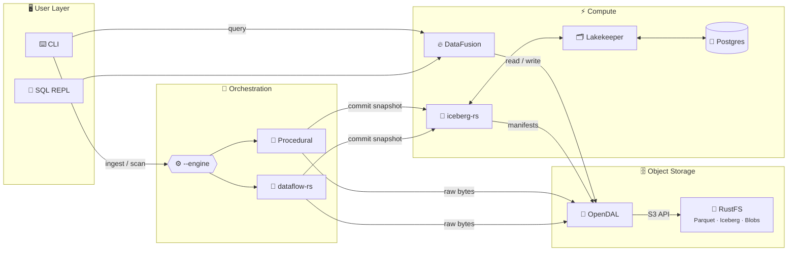

# Anti-Entropator

[](https://github.com/sm4rtm4art/anti_entropator/actions/workflows/ci.yml)
[](https://codecov.io/gh/sm4rtm4art/anti_entropator)
[](LICENSE)
[](https://www.rust-lang.org)

## **🚧 Early Public Preview / Work in Progress 🚧**
(State: 11.05.2026)

> Anti-Entropator is public early so evaluation and collaboration can happen
> while v0.3 stabilization is still in progress. Core local workflows are
> available, while some commands and release-hardening tasks are still being
> finalized. See the roadmap and security notes for current status.
----

## The Anti-Entropator <br> _Fighting entropy, one file at a time_
>
A **local data lakehouse** for file organization, built in Rust. Transform your chaotic downloads folder into a queryable, organized data store using modern data engineering patterns.

## Why?

Your downloads folder is a data swamp. This project turns it into a lakehouse by:

- **Cataloging** every file with rich metadata (type, size, hash, MIME)
- **Detecting duplicates** via content hashing
- **Organizing** files by category through metadata-driven workflows
- **Querying** your catalog with SQL

## Architecture



> **Note:** The `--engine` switch and `dataflow-rs` orchestration are targeted for v0.3.
> Current implementation uses procedural execution only. SQL REPL is a placeholder.

## Quick Start

### 1. Profile your downloads (no Docker needed)

```bash
cargo run --release -- profile ~/Downloads
```

Output:

```
═══════════════════════════════════════════════════════════════
  📊 Anti-Entropator Swamp Profile
═══════════════════════════════════════════════════════════════

  Path: /Users/you/Downloads
  Files: 4,548 | Dirs: 111 | Total size: 4.49 GiB

─── By Extension (top 25 by total size) ───────────────────────
╭───────────┬───────┬───────────┬──────────┬───────────╮
│ Extension │ Count │ Total     │ Avg      │ Max       │
├───────────┼───────┼───────────┼──────────┼───────────┤
│ .mp4      │ 811   │ 2.05 GiB  │ 2.59 MiB │ 53.81 MiB │
│ .pdf      │ 465   │ 1.11 GiB  │ 2.44 MiB │ 99.66 MiB │
...
```

### 2. Start the lakehouse stack

```bash
# Create local environment file from template
cp env.example .env

# Edit .env and replace all CHANGE_ME values first

# Create directories with correct permissions
mkdir -p data/rustfs logs/rustfs data/postgres
chown -R 10001:10001 data/rustfs logs/rustfs

# Start services
docker compose up -d

# Verify health
cargo run -- doctor
```

### 3. Scan and ingest files

```bash
# Scan & enrich metadata (read-only)
cargo run -- scan ~/Downloads --dry-run

# Preview what will be ingested
cargo run -- ingest ~/Downloads --dry-run

# Ingest files: uploads to RustFS + commits metadata to Iceberg table
cargo run -- ingest ~/Downloads
```

## Features

| Feature      | Status | Description                                  |
| ------------ | ------ | -------------------------------------------- |
| `profile`    | ✅      | Read-only directory analysis                 |
| `doctor`     | ✅      | Stack health checks                          |
| `scan`       | ✅      | Metadata enrichment with external tools      |
| `ingest`     | ✅      | Upload files & commit metadata to Iceberg    |
| `init`       | ✅      | Initialize lakehouse (bucket, warehouse, table) |
| `up`         | ✅      | Verify lakehouse services are running        |
| `query`      | ✅      | One-shot SQL queries via DataFusion (basic)  |
| `sql`        | 🚧      | Interactive SQL REPL (currently placeholder) |
| `duplicates` | 🚧      | Duplicate finder workflow (currently placeholder) |
| `merge`      | 🚧      | Ingest branch merge workflow (currently placeholder) |

**Legend:** ✅ Implemented | 🚧 In Development

## Stack Components

- **[RustFS](https://github.com/rustfs/rustfs)**: S3-compatible object storage (Apache 2.0)
- **[Lakekeeper](https://github.com/lakekeeper/lakekeeper)**: Apache Iceberg REST Catalog (Rust)
- **[Apache Iceberg](https://iceberg.apache.org/)**: Table format with time travel
- **[DataFusion](https://datafusion.apache.org/)**: SQL query engine
- **[OpenDAL](https://opendal.apache.org/)**: Unified storage I/O boundary
- **[dataflow-rs](https://github.com/dataflow-rs/dataflow-rs)**: Optional DAG-based orchestration engine (planned v0.3.0)

## Documentation

- [Getting Started](docs/manual/getting-started.md)
- [Architecture](docs/design/architecture.md)
- [Security Policy](SECURITY.md)
- [Secrets and .env Handling](docs/security/secrets-management.md)
- [Go-Public Security Checklist](docs/security/go-public-checklist.md)
- [Deployment Security Profiles](docs/security/deployment-profiles.md)
- [Docker and CI Hardening Review](docs/security/docker-hardening-review.md)
- [Blue-Green Showcase Deployment](docs/ci-cd/blue-green-showcase.md)
- [ADRs](docs/adr/) - Why we made these technology choices
- [Roadmap v0.3.0](docs/ROADMAP-v0.3.0.md) - Upcoming features and milestones

## Project Goals

1. **Clean my downloads folder** - Practical utility
2. **Learn Rust deeply** - Systems programming skills
3. **Demonstrate lakehouse patterns** - Portfolio piece
4. **Teach others** - Good documentation

## License

MIT
