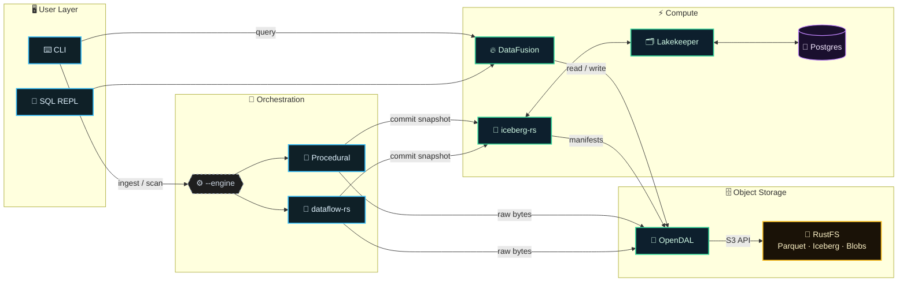

# Roadmap to v0.3.0

> **Goal (v0.3.0):** Stabilize the lakehouse pipeline, **unify storage behind one I/O boundary**, add **maintenance primitives**, and introduce **event-driven orchestration (safely / incrementally)**.

---

## Current State

### Completed (v0.2.x)

- Lakehouse stack (RustFS + Lakekeeper + Iceberg)
- File scanning with metadata extraction (exiftool, ffprobe, pdfinfo)
- Content-addressed storage in S3
- Iceberg table schema and Arrow conversion
- Parquet writing and transaction commits
- Basic `query` command with DataFusion
- `doctor` command with port conflict detection
- Proper tracing/logging throughout lakehouse module

### Status update (2026-04-29)

- M1 remains complete.
- M2 is in progress: config/ingest/scan/storage/domain unit-test expansion has landed and coverage reporting is wired into CI.
- M2 is not complete yet: the containerized end-to-end ingest-to-query integration test is still pending.
- Query status is split: one-shot `query` is implemented; `sql`, `duplicates`, and `merge` remain placeholder workflows.

### Completed (M1 -- Unified Storage, 2026-03-14)

- Replaced `aws-sdk-s3` + `aws-config` with OpenDAL for all S3 I/O
- Added `src/storage/mod.rs` with `create_operator()` factory using `LakehouseConfig`
- Bridged DataFusion to OpenDAL via `object_store_opendal` (registered under `s3://`)
- Implemented AWS SigV4 signing for bucket creation via direct HTTP (`reqwest`)
- Added Lakekeeper project bootstrapping (required since Lakekeeper >= 0.11)
- Threaded `X-Project-Id` header through `RestCatalog` for writer and query paths
- Added storage contract tests (write/read/exists/list/delete against memory backend)
- Aligned `lakekeeper-migrate` image to `latest-main` to fix schema mismatch
- Added [ADR-006](adr/ADR-006-opendal-unified-io.md) (OpenDAL) and [ADR-007](adr/ADR-007-dataflow-rs-orchestration.md) (dataflow-rs)
- Full end-to-end verified: `init` -> `ingest` (with Iceberg commit) -> `query` (DataFusion reads Parquet from RustFS)

### Test Coverage (as of 2026-02-21)

| Module             | Line Coverage | Status               |
| ------------------ | ------------- | -------------------- |
| `domain/mod.rs`    | 99%           | Excellent            |
| `domain/stats.rs`  | 84%           | Good                 |
| `scan/mod.rs`      | 75%           | OK                   |
| `lakehouse/mod.rs` | 7%            | Needs work           |
| `ingest/mod.rs`    | 44%           | Needs work           |
| **Total**          | 37%           | Target (v0.3.0): 50% |

> **Next target:** v0.4.0 → 60% overall coverage

---

## Architecture (v0.3.0 target)



---

## v0.3.0 Milestones

### M1: Unified Storage & Code Quality (The Foundation) -- COMPLETE

**Goal:** Establish the single I/O boundary _first_ so integration tests aren't written against deprecated `aws-sdk-s3` paths.

**Status:** Core tasks complete (2026-03-14). Two low-priority items deferred to M2.

#### Decision: Single I/O Boundary = OpenDAL

- **Core uses OpenDAL exclusively** for reads/writes/list/head/delete.
- DataFusion accesses storage via **`object_store_opendal`** (adapter), not direct SDKs.

#### Tasks

- ~~Remove `aws-sdk-s3` from core paths (uploads + reads) -- route through OpenDAL operator.~~ **Done**
- ~~Integrate `object_store_opendal` (register custom URL scheme in DataFusion's `RuntimeEnv`).~~ **Done**
- ~~Ensure Iceberg-rs and Anti-Entropator share one storage config source (single "Operator factory").~~ **Done** (`src/storage/mod.rs`)
- ~~Add a storage contract test suite (list/head/get/put/delete semantics against local backend).~~ **Done** (4 tests against OpenDAL memory backend)
- Refactor `files_to_batch` in `writer.rs` -- _Deferred: already clean with `BatchColumnsBuilder` pattern._
- Define typed errors (`CatalogError`, `StorageError`, `ScanError`, `IngestError`). _Deferred to M2._

---

### M2: Test Infrastructure (Verifying the Foundation)

**Goal:** Establish testing patterns and reach **≥ 45%** coverage early (so refactors stay safe).

- Add integration test for full Ingest → Query flow using `testcontainers-rs`.
  - Postgres container for Lakekeeper backend.
  - **Prefer RustFS container** for S3 (if feasible).
  - If RustFS container is not feasible yet: use MinIO as a **test-only compatibility harness**.
- Add unit tests for `writer.rs` functions (`files_to_batch`, `create_file_io`).
- ~~Add unit tests for `config/mod.rs` (pure parsing, easy win).~~ **Done**
- Add unit tests for `lakehouse/schema.rs` (schema building).
- Expand unit tests for `ingest/mod.rs`, `scan/mod.rs`, `storage/mod.rs`, and `domain/file_info.rs`. **In progress**
- ~~Set up `cargo-llvm-cov` in CI workflow.~~ **Done**
- Add test fixtures (sample files for scan tests).
- Add “golden” tests for schema/Arrow conversion (snapshot testing).

---

### M3: Query & Maintenance (prevent bloat + safe cleanup)

**Goal:** Make `query` more useful and add lifecycle tasks to prevent catalog/object-store drift.

#### Query UX

- Add output format options (table, JSON, CSV).
- Add basic filters (category, size range, date range).
- Add `--limit` and `--offset` for pagination.

#### Maintenance Commands (with safety guarantees)

- **Add `maintenance expire`**
  - Expires old Iceberg snapshots / metadata to control catalog bloat.
  - Respects named references (e.g., branches/tags) if used.

- **Add `maintenance vacuum` (mark-and-sweep)**
  - Finds orphan CAS blobs not referenced by any live snapshot.
  - **Design Prerequisite:** Explicitly define "live reference" (e.g., _any_ snapshot within the retention window, not just the current `HEAD`).
  - **Safety requirements:**
    - `--dry-run` (default).
    - `--apply` required for deletion.
    - `--older-than <duration>` required (e.g., `7d`) to avoid racing with in-flight commits.

#### Optimize (de-risked)

- **Add `optimize plan` (v0.3.0)**
  - Reports small-file groups + estimated rewrite savings.

- Optional / gated:
  - `optimize apply` behind `--experimental` (or feature flag).
  - Must commit rewrites through Iceberg correctly (replace files, preserve partitions, handle conflicts).

---

### M4: Orchestration & Observability (incremental DAG adoption)

**Goal:** Introduce DAG-based orchestration without blocking release stability.

#### Strategy: Dual Engine (safe rollout)

- Keep procedural pipeline as default.
- Introduce dataflow-rs pipeline behind:
  - `--engine procedural|dataflow` OR
  - feature flag `--features orchestration`.

#### Tasks

- Integrate `dataflow-rs` as an optional execution engine:
  - Scan → Hash → Upload → Commit as a DAG.
- Add structured spans (`tracing`) per stage (supports flamegraphs).
- Add `indicatif` progress bars (multi-thread friendly).
- Add a single “pipeline event” schema (start/stop/error counters) for consistent logging/metrics.

---

### M5: Documentation & Polish (release-ready)

**Goal:** Prepare for release and improve contributor experience.

- Update README with new architecture (procedural + dataflow engine, unified IO).
- Document all CLI commands with examples.
- Add troubleshooting section (common errors).
- **Add “maintenance safety” docs:** Explicitly define the design semantics of `vacuum` (live references) and `expire`.
- Clean up remaining TODOs and add a “Design Decisions” page.

---

## Technical Decisions (v0.3.0)

### Keep Rust-Focused

- Avoid JVM dependencies (no Apache Tika).
- External CLI tools allowed short-term; migrate to pure Rust extractors long-term.
- Single unified I/O boundary via OpenDAL; DataFusion via `object_store_opendal`.

### Schema Evolution over Redesign

- Iceberg supports adding columns without rewriting.
- Start lean, add columns as patterns emerge.
- Consider `metadata_json` column for overflow / extractor-specific data.

### Test Strategy

- Unit tests for pure functions (domain, schema, config).
- Integration tests with containers for I/O and catalog interactions.
- Mock external tools (exiftool, ffprobe) for CI determinism.

---

## Success Criteria for v0.3.0

1. **Test coverage ≥ 50%** (up from 37%).
2. **Unified Storage:** Core I/O exclusively uses OpenDAL; DataFusion reads through `object_store_opendal`.
3. **Maintenance:** `maintenance expire` + `maintenance vacuum` exist with strict safety flags (`--dry-run`, `--apply`, `--older-than`).
4. **Orchestration:** dataflow-rs engine available **without removing** procedural ingest.
5. **CI passes** with `cargo test`, `cargo clippy`, `cargo fmt --check`.

---

## Sprint Backlog (Next Up)

| Priority | Task                                             | Effort | Status      | Notes                                                    |
| -------- | ------------------------------------------------ | ------ | ----------- | -------------------------------------------------------- |
| ~~P0~~   | ~~Replace `aws-sdk-s3` core paths with OpenDAL~~ | ~~Medium~~ | **Done** | Completed 2026-03-14                                     |
| ~~P0~~   | ~~Bridge DataFusion via `object_store_opendal`~~  | ~~Small~~  | **Done** | Registered under `s3://` URL scheme                      |
| P1       | Integration test: Ingest -> Query (containers)   | Medium | **Next**    | Builds on stable OpenDAL boundary                        |
| P1       | Add `maintenance expire` + `vacuum` (safe flags) | Medium | Pending     | Requires design note on "live references"                |
| P2       | Introduce dataflow-rs engine behind flag/switch  | Large  | Pending     | Run side-by-side with procedural                         |
| P2       | Add `optimize plan` (report-only)                | Small  | Pending     |                                                          |
| P2       | Refactor `files_to_batch` into helpers           | Small  | Deferred    | Already clean with `BatchColumnsBuilder`                 |

---

## Future Vision (v0.4.0+)

### Medallion Architecture (Bronze/Silver/Gold)

```text
RustFS Buckets:
├── bronze/          # Raw file blobs (content-addressed) ← Current
├── silver/          # Processed/optimized versions (future)
├── gold/            # Thumbnails, previews, exports (future)
└── warehouse/       # Iceberg metadata ← Current

Iceberg Tables:
├── bronze.file_catalog      # Raw scan results ← Current
├── silver.file_catalog      # Deduplicated, enriched (future)
├── gold.file_stats          # Aggregated statistics (future)
└── gold.duplicate_groups    # Grouped duplicates (future)
```

### Data Exploration & Viewer

- TUI Viewer (`explore`): interactive table viewer using `ratatui`.
- Web Gallery (`ui`): lightweight `axum` server to browse thumbnails and play media from RustFS.
- System Preview (`preview`): open a lakehouse file with the native OS viewer.

### Multi-Cloud Storage (via OpenDAL)

- Expand OpenDAL config to support GCS, Azure, and local filesystem natively.
- Enable multi-cloud beyond local S3/RustFS.

### Pure Rust Extractors (Single Binary Goal)

- Replace `exiftool` with `kamadak-exif`.
- Replace `pdfinfo` with `lopdf` or `pdf-extract`.
- Replace `ffprobe` with `symphonia` (audio/video parsing). _Note: Symphonia is highly mature; this could be pulled forward if desired._
- Benefit: remove system dependencies → true drop-in single binary.

---

_Last updated: 2026-04-29_
