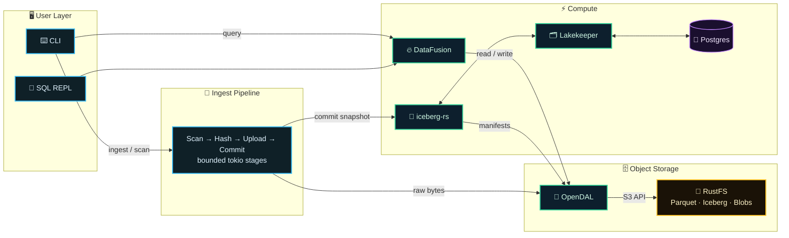

# Roadmap to v0.3.0

> **Goal (v0.3.0, re-scoped 2026-09-17):** a **correct local lakehouse for
> file ingest and query**: one I/O boundary (OpenDAL), ingest that is
> idempotent and honest about failure (ADR-009 observation semantics, durable
> run identity), a binary that contains only implemented commands, and CI /
> release gates proven on a real tag. Maintenance primitives and pipeline
> observability (event schema, span coverage, tuning) move to **v0.4.0**;
> interactive SQL, duplicate workflow, and branch merge to **v0.5.0+**.
> (Bounded pipeline concurrency itself shipped in v0.3.0 with S6A slice 3c.)

---

## Current State

### Completed (v0.2.x)

- Lakehouse stack (RustFS + Lakekeeper + Iceberg)
- File scanning with metadata extraction (exiftool, ffprobe, pdfinfo)
- Content-addressed storage in S3
- Iceberg table schema and Arrow conversion
- Parquet writing and transaction commits
- Basic `query` command with DataFusion
- `doctor` command with port conflict detection
- Proper tracing/logging throughout lakehouse module

### Status update (2026-04-29)

- M1 remains complete.
- M2 is in progress: config/ingest/scan/storage/domain unit-test expansion has landed and coverage reporting is wired into CI.
- M2 is not complete yet: the containerized end-to-end ingest-to-query integration test is still pending.
- Query status is split: one-shot `query` is implemented; `sql`, `duplicates`, and `merge` remain placeholder workflows.

### Status update (2026-04-30)

- Public-showcase stabilization closeout is complete.
- The active execution model now runs in stabilization blocks:
  - S1: Security and reliability core fixes.
  - S2: Test pyramid completion (unit/integration/E2E).
  - S3: Secrets and auth hardening by deployment profile.
  - S4: Technical debt and misleading-pattern audit.
  - S5: CI/CD and multi-arch container path.
- Order note: S4 intentionally precedes S5 so deployment expansion builds on lower debt and cleaner signal quality.

### Status update (2026-05-01)

- Authority rule: this roadmap remains the release contract for `v0.3.0`.
- The local `v0.3-stabilization-plan.md` is the active execution lane and triage queue, not a replacement for this roadmap's success criteria.
- S1-S4 stabilization work is the prerequisite gate before resuming M3/M4 implementation work.
- S5 (CI/CD and multi-arch hardening) runs after feature gates and before release tagging.
- `v0.3.0` completion still requires maintenance primitives, orchestration gate, and numeric coverage floor from the success criteria section below.

### Status update (2026-06-24)

- CI now enforces the roadmap coverage floor (`>= 50%`) in the main/scheduled
  coverage job via `cargo llvm-cov --fail-under-lines 50`.

### Status update (2026-07-26)

- Stabilization lane: **S5 complete**; **S6** (final cleanup / release-readiness
  sweep) is next month. Active execution detail remains in local
  `v0.3-stabilization-plan.md`; this roadmap stays the `v0.3.0` release contract.
- OpenDAL / `quick-xml` real upgrade remains deferred (DataFusion /
  `object_store` compatibility). Temporary `cargo audit` ignores for
  `RUSTSEC-2026-0195` and `RUSTSEC-2026-0194` are in `.cargo/audit.toml`;
  remove when OpenDAL/`reqsign` resolve to `quick-xml >= 0.41` (S6 re-validates).
- Dependabot `thrift` advisory stays open — transitive via Parquet/DataFusion;
  no in-range bump; revisit with a stack-major evaluation.
- **dataflow-rs is off the table** (ADR-007 superseded 2026-09-17: the crate
  is a JSONLogic rules engine, not a DAG executor). M4 stage concurrency and
  observability are delivered inside the single procedural engine with
  `tokio` stages; there is no `--engine` flag and none is planned.
- Query identity reminder: Iceberg table is `file_catalog`; `FROM files` is CLI
  sugar rewritten by `query` to `iceberg.anti_entropator.file_catalog`.

### Status update (2026-09-13)

- The S1-S6 stabilization execution plan is complete and archived. A fresh
  Docker-backed `init` → `ingest` → `query` test passed, and Lakekeeper exposed
  the expected `anti-entropator` project and warehouse.
- This does **not** complete v0.3.0. S6A ingest correctness/recovery is the next
  active execution plan and blocks M3 destructive maintenance and M4
  orchestration.
- ADR-006 now describes the implemented storage boundary accurately:
  application/DataFusion and Iceberg use separate OpenDAL construction paths
  fed by the same `LakehouseConfig`.
- `RUSTSEC-2026-0221` was cleared by updating transitive `event-listener` to
  5.4.2. The `quick-xml` ignores remain accepted until a compatible OpenDAL
  stack resolves to `quick-xml >= 0.41`; the medium transitive `thrift` alert
  remains assigned to the dependency-major evaluation.

### Status update (2026-09-17) — release re-scope

- **Why:** the success criteria below required maintenance commands and a
  second orchestration engine for `v0.3.0`, while the active plan had already
  deferred both and ADR-007 was found to name a crate that does not do what
  the ADR assumed. The contract and the plan disagreed; this entry makes the
  contract honest and reachable.
- **v0.3.0 now means:** S6A correctness slices 3 (streaming, mutation-safe
  CAS upload with ADR-009 observation semantics) and 4 (durable run journal;
  interrupted or partial runs never exit 0) on top of what already ships.
- **Moved to v0.4.0:** M3 maintenance (`expire`, `vacuum`, `optimize plan`),
  M3 query UX (output formats, filters, pagination), M4 pipeline
  observability (event schema, full span coverage, tuning). Reason: `vacuum`
  needs ADR-009 run identity to define "live reference" safely. The bounded
  stage wiring itself was built inside the slice-3 pipeline (3c, 2026-09-18)
  and did ship in v0.3.0.
- **Moved to v0.5.0+:** interactive SQL, duplicate workflow, ingest branch
  merge. Their placeholder subcommands were removed from the binary
  (2026-09-17); duplicate content is answerable today with one `GROUP BY`
  query (see the manual).
- **ADR-007 superseded** (dataflow-rs dropped; single engine). ADR-001..005
  received a verified-facts pass. RustFS stays on `1.0.0-beta.2`: the 1.0.0
  GA image fails store init on an existing beta.2 data directory (evidence in
  `docs/security/docker-hardening-review.md`).
- Dated status entries above are kept as written; they are history, not
  current claims.

### Status update (2026-09-18) — release

- S6A slices 3a (#218), 3b (#219), 3c (#220), and 4a (#221) are on `main`.
  Success criteria 1–5 and 7 are met (evidence per criterion below).
- Release prep: crate version `0.3.0`, `CHANGELOG.md` `[0.3.0]` cut, this
  entry. Criterion 6 is satisfied by the `v0.3.0` tag itself: the tag push
  runs `release.yml` (quality gates, binaries, container verify + Trivy
  fixable-only policy, GHCR publish, GitHub release). A `workflow_dispatch`
  rehearsal of the same workflow on the release commit precedes the tag.
- Correction to the 2026-09-17 entry: RustFS did move to `1.0.0` afterwards
  (#215, named volume `rustfs-data`); the beta.2 note above is history.
- Open after v0.3.0 (tracked in the backlog): single-writer ingest lease
  (4b), deletion/rename observations, maintenance primitives, M4
  observability, the `iceberg 0.11` stack bump (removes the two `cargo audit`
  ignores; re-check the `FixedSizeBinary(16)` null-fill limitation).

### Completed (M1 -- Unified Storage, 2026-03-14)

- Replaced `aws-sdk-s3` + `aws-config` with OpenDAL for all S3 I/O
- Added `src/storage/mod.rs` with `create_operator()` factory using `LakehouseConfig`
- Bridged DataFusion to OpenDAL via `object_store_opendal` (registered under `s3://`)
- Implemented AWS SigV4 signing for bucket creation via direct HTTP (`reqwest`)
- Added Lakekeeper project bootstrapping (required since Lakekeeper >= 0.11)
- Threaded `X-Project-Id` header through `RestCatalog` for writer and query paths
- Remaining direct catalog REST helper coverage for `X-Project-Id` is tracked in S1 stabilization queue and is not considered complete until those paths are fixed and tested.
- Added storage contract tests (write/read/exists/list/delete against memory backend)
- Aligned `lakekeeper-migrate` image to `latest-main` to fix schema mismatch
- Added [ADR-006](adr/ADR-006-opendal-unified-io.md) (OpenDAL) and [ADR-007](adr/ADR-007-dataflow-rs-orchestration.md) (dataflow-rs; superseded 2026-09-17)
- Full end-to-end verified: `init` -> `ingest` (with Iceberg commit) -> `query` (DataFusion reads Parquet from RustFS)

### Test Coverage (historical snapshot, 2026-02-21)

> Since 2026-06-24 CI enforces the `v0.3.0` floor with
> `cargo llvm-cov --fail-under-lines 50` on main and scheduled runs; the
> per-module numbers below are the pre-stabilization baseline and are not
> maintained by hand.

| Module             | Line Coverage | Status               |
| ------------------ | ------------- | -------------------- |
| `domain/mod.rs`    | 99%           | Excellent            |
| `domain/stats.rs`  | 84%           | Good                 |
| `scan/mod.rs`      | 75%           | OK                   |
| `lakehouse/mod.rs` | 7%            | Needs work           |
| `ingest/mod.rs`    | 44%           | Needs work           |
| **Total**          | 37%           | Target (v0.3.0): 50% |

> **Next target:** v0.4.0 → 60% overall coverage

---

## Architecture (v0.3.0 target)



---

## v0.3.0 Milestones

### M1: Unified Storage & Code Quality (The Foundation) -- COMPLETE

**Goal:** Establish the single I/O boundary _first_ so integration tests aren't written against deprecated `aws-sdk-s3` paths.

**Status:** Core tasks complete (2026-03-14). Two low-priority items deferred to M2.

#### Decision: Single I/O Boundary = OpenDAL

- **Core uses OpenDAL exclusively** for reads/writes/list/head/delete.
- DataFusion accesses storage via **`object_store_opendal`** (adapter), not direct SDKs.

#### Tasks

- ~~Remove `aws-sdk-s3` from core paths (uploads + reads) -- route through OpenDAL operator.~~ **Done**
- ~~Integrate `object_store_opendal` (register custom URL scheme in DataFusion's `RuntimeEnv`).~~ **Done**
- ~~Ensure Iceberg-rs and Anti-Entropator share one storage config source while
  using their supported OpenDAL adapters.~~ **Done** (`LakehouseConfig`;
  application/DataFusion use `storage::create_operator`, Iceberg uses
  `iceberg-storage-opendal`)
- ~~Add a storage contract test suite (list/head/get/put/delete semantics against local backend).~~ **Done** (4 tests against OpenDAL memory backend)
- Refactor `files_to_batch` in `writer.rs` -- _Deferred: already clean with `BatchColumnsBuilder` pattern._
- Define typed errors (`CatalogError`, `StorageError`, `ScanError`, `IngestError`). _Deferred to M2._

---

### M2: Test Infrastructure (Verifying the Foundation)

**Goal:** Establish testing patterns and reach **≥ 45%** coverage early (so refactors stay safe).

- ~~Add integration test for full Ingest → Query flow.~~ **Done** as the
  Docker-gated `ingest_then_query_flow` CLI test against the Compose stack
  (RustFS + Lakekeeper + Postgres), run with `--ignored`. `testcontainers-rs`
  was not adopted; MinIO is not used anywhere (rejected stack, see
  `.cursor/rules/project-architecture.mdc`).
- ~~Add unit tests for `writer.rs` functions (`files_to_batch`, `create_file_io`).~~ **Done**
- ~~Add unit tests for `config/mod.rs` (pure parsing, easy win).~~ **Done**
- ~~Add unit tests for `lakehouse/schema.rs` (schema building).~~ **Done**
- Expand unit tests for `ingest/mod.rs`, `scan/mod.rs`, `storage/mod.rs`, and `domain/file_info.rs`. **In progress**
- ~~Set up `cargo-llvm-cov` in CI workflow.~~ **Done**
- Add test fixtures (sample files for scan tests).
- Add “golden” tests for schema/Arrow conversion (snapshot testing).

---

### M3: Query & Maintenance (prevent bloat + safe cleanup) — **moved to v0.4.0**

> Re-scoped 2026-09-17. `vacuum` needs ADR-009 run identity to define a live
> reference safely, so M3 follows the v0.3.0 correctness slices instead of
> gating them. Content kept as the v0.4.0 design.

**Goal:** Make `query` more useful and add lifecycle tasks to prevent catalog/object-store drift.

#### Query UX

- Add output format options (table, JSON, CSV).
- Add basic filters (category, size range, date range).
- Add `--limit` and `--offset` for pagination.

#### Maintenance Commands (with safety guarantees)

- **Add `maintenance expire`**
  - Expires old Iceberg snapshots / metadata to control catalog bloat.
  - Respects named references (e.g., branches/tags) if used.

- **Add `maintenance vacuum` (mark-and-sweep)**
  - Finds orphan CAS blobs not referenced by any live snapshot.
  - **Design Prerequisite:** Explicitly define "live reference" (e.g., _any_ snapshot within the retention window, not just the current `HEAD`).
  - **Safety requirements:**
    - `--dry-run` (default).
    - `--apply` required for deletion.
    - `--older-than <duration>` required (e.g., `7d`) to avoid racing with in-flight commits.

#### Optimize (de-risked)

- **Add `optimize plan` (v0.3.0)**
  - Reports small-file groups + estimated rewrite savings.

- Optional / gated:
  - `optimize apply` behind `--experimental` (or feature flag).
  - Must commit rewrites through Iceberg correctly (replace files, preserve partitions, handle conflicts).

---

### M4: Pipeline Concurrency & Observability (single engine) — **moved to v0.4.0**

> Re-scoped 2026-09-17. The stage wiring is built during S6A slice 3 (v0.3.0);
> the tracing spans, pipeline event schema, and tuning of concurrency limits
> are v0.4.0 work.

**Goal:** Bounded, observable stage concurrency in the one procedural
pipeline. No second execution engine.

> Amended 2026-09-17: ADR-007 (dataflow-rs, dual engine, `--engine`) is
> superseded. The named crate is a JSONLogic rules engine, not a DAG executor.
> See the ADR for evidence.

#### Strategy

- `Scan → Hash → Upload → Commit` stay as stages of the single pipeline,
  connected by bounded `tokio::sync::mpsc` channels with explicit per-stage
  concurrency limits (`JoinSet` / `Semaphore`).
- The stage wiring is built during the S6A item 3 upload rewrite (streaming
  hash, temp-then-finalize, byte/concurrency budgets), so M4 stops being a
  separate engine project and becomes the observability layer on top of it.

#### Tasks

- ~~Bounded stage channels and concurrency limits~~ — **shipped with S6A
  slice 3c** (`JoinSet` worker pool bounded by `--concurrency`, bounded
  `mpsc` into a writer stage committing every `--batch-size` rows;
  `ingest.file` and `ingest.commit` spans).
- Add structured spans (`tracing`) per stage (supports flamegraphs); scan and
  hash spans, and a pipeline event schema, remain.
- Keep `indicatif` progress bars multi-thread friendly.
- Add a single “pipeline event” schema (start/stop/error counters) for consistent logging/metrics.

---

### M5: Documentation & Polish (release-ready)

**Goal:** Prepare for release and improve contributor experience.

- Update README with the current architecture (single staged pipeline, unified IO).
- Document all CLI commands with examples.
- Add troubleshooting section (common errors).
- **Add “maintenance safety” docs:** Explicitly define the design semantics of `vacuum` (live references) and `expire`.
- Clean up remaining TODOs and add a “Design Decisions” page.

---

## Technical Decisions (v0.3.0)

### Keep Rust-Focused

- Avoid JVM dependencies (no Apache Tika).
- External CLI tools allowed short-term; migrate to pure Rust extractors long-term.
- Single unified I/O boundary via OpenDAL; DataFusion via `object_store_opendal`.

### Schema Evolution over Redesign

- Iceberg supports adding columns without rewriting.
- Start lean, add columns as patterns emerge.
- Consider `metadata_json` column for overflow / extractor-specific data.

### Test Strategy

- Unit tests for pure functions (domain, schema, config).
- Integration tests with containers for I/O and catalog interactions.
- Mock external tools (exiftool, ffprobe) for CI determinism.

---

## Success Criteria for v0.3.0 (re-scoped 2026-09-17)

Each criterion names its evidence. A criterion without evidence is not met.

1. **Unified storage** — all object-store I/O through OpenDAL; DataFusion via
   `object_store_opendal`, iceberg-rs via `iceberg-storage-opendal`; one
   `LakehouseConfig` source. _Evidence:_ ADR-006 Current State; no
   `aws-sdk-s3` in `Cargo.lock`. **Met.**
2. **Honest CLI** — every subcommand in the binary is implemented and tested;
   `--help` lists nothing else; `ingest --dry-run` is a connected preview;
   partial or complete failures exit non-zero in every mode. _Evidence:_
   `tests/cli_tests.rs` (`placeholder_commands_are_not_advertised_or_accepted`,
   `ingest_*` failure and mode tests). **Met** (2026-09-17).
3. **Ingest correctness (ADR-009 slice 3)** — identical bytes at different
   paths produce one observation per path; changed bytes at the same path
   produce a new observation; re-running an unchanged ingest appends nothing;
   upload streams with a bounded memory footprint and does not corrupt a blob
   when the source file changes mid-read. _Evidence:_ unit tests for the
   transition table plus the Docker-gated e2e extended with a duplicate-path
   and a changed-file case (PRs #218, #219); bounded pipeline with batched
   commits and a commit-failure injection test (S6A slice 3c); measured
   2026-09-18 on a synthetic 5000-file / 1.98 GiB tree: 5 batches, peak RSS
   128 MiB. **Met** (2026-09-18).
4. **Recovery (ADR-009 slice 4, minimum)** — every ingest run has a durable
   `run_id`; an interrupted or partially failed run is never reported as
   success and its state is identifiable afterwards. _Evidence:_ run journal
   at `_runs/<run_id>.json` with lifecycle transitions, `runs list` /
   `runs show`, and the Docker-gated `interrupted_ingest_is_recorded_and_reconciled`
   test: SIGKILL after the first batch commit → non-zero exit, open journal,
   catalog count matches, the next run reconciles and supersedes it (4/4
   stable, 2026-09-18). **Met** (S6A slice 4a). Single-writer lease (4b)
   is not a criterion and stays open.
5. **Quality gates** — `cargo fmt --check`, `clippy -D warnings`, tests,
   `cargo audit` (documented ignores only), coverage floor `≥ 50%` enforced by
   `--fail-under-lines 50`. _Evidence:_ green `ci.yml` on `main`. **Met**,
   re-verified per PR.
6. **Release path proven on a real tag** — the `v0.3.0` tag runs the release
   workflow end to end (quality gates, container verify + Trivy fixable-only
   policy, GHCR publish, GitHub release). _Evidence:_ tag `v0.3.0` pushed
   2026-09-18; [release run 35376014640](https://github.com/sm4rtm4art/anti_entropator/actions/runs/35376014640)
   green end to end, [GitHub release v0.3.0](https://github.com/sm4rtm4art/anti_entropator/releases/tag/v0.3.0)
   published with the Linux and macOS binaries. The preceding
   `workflow_dispatch` rehearsal on the release commit is
   [run 35365542813](https://github.com/sm4rtm4art/anti_entropator/actions/runs/35365542813).
   **Met.**
7. **Docs match behavior** — README command table, manual, and ADR-001..009
   describe what ships; planned work is labeled planned. _Evidence:_ the
   2026-09-17 audit PRs. **Met**, re-verified per PR.

Deferred out of `v0.3.0` (see the 2026-09-17 status entry): maintenance
`expire`/`vacuum`/`optimize plan`, query output formats and pagination,
per-stage tracing and concurrency tuning (all v0.4.0); interactive SQL,
duplicate workflow, branch merge (v0.5.0+).

> Execution note: all seven criteria are met as of the `v0.3.0` tag
> (2026-09-18). This roadmap is closed; open items below are carried into the
> v0.4.0 plan.

---

## Sprint Backlog (Next Up)

| Priority | Task                                             | Effort | Status      | Notes                                                    |
| -------- | ------------------------------------------------ | ------ | ----------- | -------------------------------------------------------- |
| ~~P0~~   | ~~Replace `aws-sdk-s3` core paths with OpenDAL~~ | ~~Medium~~ | **Done** | Completed 2026-03-14                                     |
| ~~P0~~   | ~~Bridge DataFusion via `object_store_opendal`~~  | ~~Small~~  | **Done** | Registered under `s3://` URL scheme                      |
| ~~P0~~   | ~~S1 correctness queue (ingest filters, SQL rewrite, ingest counters)~~ | ~~Medium~~ | **Done** | S1–S6 closed 2026-09-13; S6A slices 1, 2a–2d merged 2026-09-17 |
| ~~P1~~   | ~~Integration test: Ingest -> Query (containers)~~ | ~~Medium~~ | **Done** | Docker-gated `ingest_then_query_flow` against the Compose stack |
| ~~P0~~   | ~~S6A slice 3: streaming, mutation-safe CAS upload + ADR-009 observation semantics~~ | ~~Large~~ | **Done** | 3a #218, 3b #219, 3c bounded pipeline + batched commits (criterion 3 met 2026-09-18) |
| ~~P0~~   | ~~S6A slice 4a: durable run journal, non-success on interruption~~ | ~~Medium~~ | **Done** | Criterion 4 met 2026-09-18; `runs` command, kill test |
| ~~P1~~   | ~~Tag `v0.3.0`; release workflow evidence on the tag~~ | ~~Small~~ | **Done** | Criterion 6 met 2026-09-18; run 35376014640 |
| P2       | S6A slice 4b: single-writer lease per source | Small | v0.4.0 | `if_not_exists` lease object, TTL, stale takeover |
| P2       | Add `maintenance expire` + `vacuum` (safe flags) | Medium | v0.4.0      | Needs ADR-009 run identity for "live reference"          |
| P2       | Per-stage `tracing` spans, pipeline event schema (M4) | Medium | v0.4.0 | dataflow-rs dropped (ADR-007 superseded)                 |
| ~~P2~~   | ~~S5 CI/CD hardening (Trivy + multi-arch path)~~ | ~~Medium~~ | **Done** | S5 closed; residual multi-arch/Trivy enforcement deferred |
| P2       | Add `optimize plan` (report-only)                | Small  | v0.4.0      |                                                          |
| ~~P3~~   | ~~RustFS `1.0.0` upgrade path for existing data dirs~~ | ~~Small~~ | **Done** | #215: GA image on a named volume (`rustfs-data`); bind-mount failure documented in the hardening review |
| P2       | Refactor `files_to_batch` into helpers           | Small  | Deferred    | Already clean with `BatchColumnsBuilder`                 |

---

## Future Vision (v0.4.0+)

### Medallion Architecture (Bronze/Silver/Gold)

```text
RustFS Buckets:
├── bronze/          # Raw file blobs (content-addressed) ← Current
├── silver/          # Processed/optimized versions (future)
├── gold/            # Thumbnails, previews, exports (future)
└── warehouse/       # Iceberg metadata ← Current

Iceberg Tables:
├── bronze.file_catalog      # Raw scan results ← Current
├── silver.file_catalog      # Deduplicated, enriched (future)
├── gold.file_stats          # Aggregated statistics (future)
└── gold.duplicate_groups    # Grouped duplicates (future)
```

### Data Exploration & Viewer

- TUI Viewer (`explore`): interactive table viewer using `ratatui`.
- Web Gallery (`ui`): lightweight `axum` server to browse thumbnails and play media from RustFS.
- System Preview (`preview`): open a lakehouse file with the native OS viewer.

### Multi-Cloud Storage (via OpenDAL)

- Expand OpenDAL config to support GCS, Azure, and local filesystem natively.
- Enable multi-cloud beyond local S3/RustFS.

### Pure Rust Extractors (Single Binary Goal)

- Replace `exiftool` with `kamadak-exif`.
- Replace `pdfinfo` with `lopdf` or `pdf-extract`.
- Replace `ffprobe` with `symphonia` (audio/video parsing). _Note: Symphonia is highly mature; this could be pulled forward if desired._
- Benefit: remove system dependencies → true drop-in single binary.

---

_Last updated: 2026-05-01_
