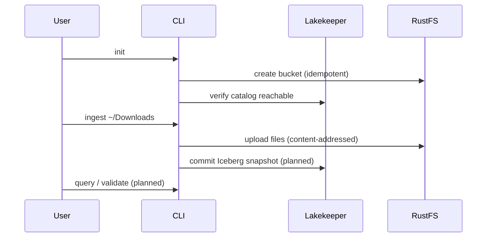

# ADR-004: Lakekeeper as Iceberg REST Catalog

## Context

Iceberg tables require a catalog to manage table metadata, namespaces, and provide consistent reads/writes.

This project is intentionally “over-engineered” as a learning/portfolio lakehouse, but we still want the local stack to stay **tight**:

- No JVM runtime in the catalog service (reduce operational complexity / attack surface)
- A standards-based API that query engines understand (Iceberg REST Catalog)
- Easy local deployment via Docker Compose

## Decision

We will use **Lakekeeper** as the Iceberg catalog (Iceberg REST Catalog specification).

## Consequences

### Positive

- **No JVM**: Lakekeeper is written in Rust and runs as a single service.
- **Standards-based**: Implements the Iceberg REST Catalog spec, improving interoperability.
- **Simple local story**: Docker Compose + one endpoint (`http://localhost:8181`) for catalog + UI.

### Negative

- **Still needs a DB**: Lakekeeper uses Postgres for catalog state (more moving parts than a file-based catalog).
- **Not “Git for data”**: We lose Nessie-style branching/merging semantics across tables. We rely on Iceberg snapshots/time-travel and HITL workflows instead.

## Workflow

## Alternatives Considered

- **Nessie**: Very capable, but adds JVM + Postgres (more operational/security surface than desired for this repo).
- **File-based catalog**: Simpler but limited interoperability and weaker consistency story.
- **AWS Glue Catalog**: Cloud-only, not suitable for local development
- **Hive Metastore**: Heavy Java dependency, complex setup

## References

- [Lakekeeper](https://github.com/lakekeeper/lakekeeper)
- [Lakekeeper docs](https://docs.lakekeeper.io/)
