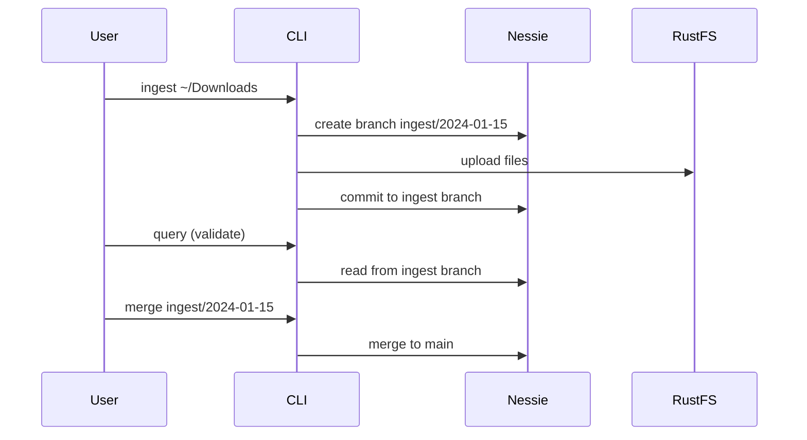

# ADR-004: Nessie as Iceberg Catalog

## Context

Iceberg tables require a catalog to manage table metadata, namespaces, and provide consistent reads/writes. We want a catalog that supports Git-like versioning to enable safe data ingestion workflows (branch, validate, merge).

## Decision

We will use **Project Nessie** as the Iceberg catalog from day one.

## Consequences

### Positive

- **Git-like semantics**: Branches, tags, and commits for data
- **Safe ingestion**: Write to `ingest/<timestamp>` branch, validate, then merge to main
- **Rollback capability**: Revert to previous commits if issues found
- **Unity-like workflow**: Similar to Databricks Unity Catalog concepts
- **REST API**: Easy to integrate from any language
- **Learning value**: Demonstrates understanding of modern catalog patterns

### Negative

- **Additional service**: Requires running Nessie + Postgres containers
- **Complexity**: More moving parts than a simple file-based catalog
- **Setup overhead**: Must configure JDBC backend (Postgres)

## Workflow

## Alternatives Considered

- **File-based catalog**: Simpler but no branching, concurrent access issues
- **AWS Glue Catalog**: Cloud-only, not suitable for local development
- **Hive Metastore**: Heavy Java dependency, complex setup

## References

- [Project Nessie](https://projectnessie.org/)
- [Nessie + Iceberg integration](https://projectnessie.org/guides/iceberg/)
