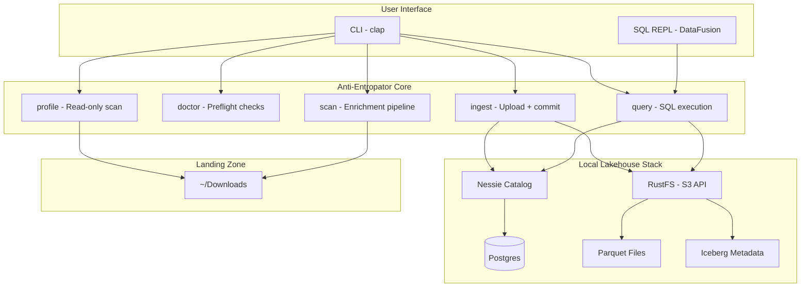
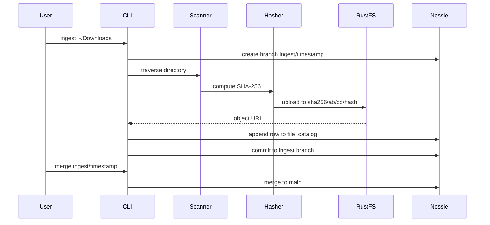

# Anti-Entropator Architecture

## Overview

Anti-Entropator is a **local data lakehouse** for file organization. It transforms a chaotic downloads folder into a queryable, organized data store using modern data engineering patterns.

## Architecture Diagram



## Component Responsibilities

### CLI Layer

- **clap**: Command parsing and help generation
- **rustyline**: Interactive SQL REPL with history

### Core Commands

- **profile**: Read-only directory analysis (no Docker needed)
- **doctor**: Verify stack health and external tools
- **scan**: Enrich file metadata without uploading
- **ingest**: Upload to RustFS + commit to Iceberg via Nessie
- **query**: Execute SQL via DataFusion

### Storage Layer

- **RustFS**: S3-compatible object storage (replaces MinIO)
- **Parquet**: Columnar file format with ZSTD compression
- **Iceberg**: Table format with schema evolution and time travel

### Catalog Layer

- **Nessie**: Git-like versioning for data (branches, commits, tags)
- **Postgres**: Backend storage for Nessie catalog state

## Data Flow

### Ingest Pipeline



### Content-Addressed Storage

Files are stored with keys derived from their content hash:

```
s3://anti-entropator/warehouse/
└── sha256/
    ├── ab/
    │   └── cd/
    │       └── abcd1234...5678  (actual file bytes)
    └── ef/
        └── gh/
            └── efgh9012...3456
```

Benefits:

- **Idempotent uploads**: Same file always gets same key
- **Natural deduplication**: Identical files share storage
- **Verifiable**: Key proves content integrity

## Configuration

Configuration is loaded from (in order):

1. `--config` CLI flag
2. `ANTI_ENTROPATOR_CONFIG` environment variable
3. `./anti_entropator.toml`
4. `~/.config/anti_entropator/config.toml`

## Error Handling

Following the project's Rust rules:

- **Library code**: Uses `thiserror` for typed errors
- **Binary/CLI**: Uses `anyhow` for ergonomic error handling
- **No `.unwrap()` on I/O**: All filesystem operations use `?` or `match`

## Safety Guarantees

1. **Local files never deleted by default**: Ingest only copies, doesn't move
2. **Dry-run mandatory**: Every mutation has `--dry-run` / `--apply` flags
3. **Branch workflow**: Ingests go to isolated branches before merge
4. **Atomic operations**: Iceberg commits are all-or-nothing
