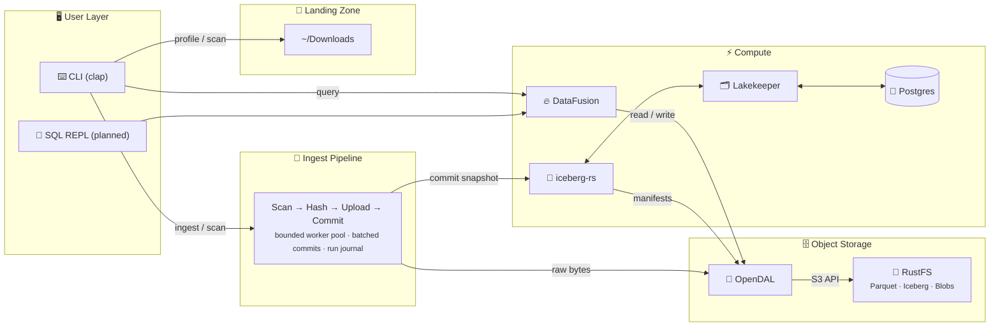
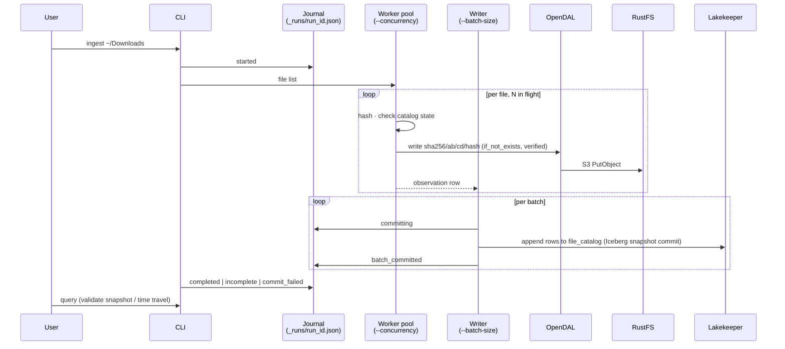

# Anti-Entropator Architecture

## Overview

Anti-Entropator is a **local data lakehouse** for file organization. It transforms a chaotic downloads folder into a queryable, organized data store using modern data engineering patterns.

## Architecture Diagram



> **Note:** There is one ingest engine. Bounded stage concurrency shipped in
> v0.3.0 (S6A slice 3c); per-stage tracing and a pipeline event schema are
> roadmap M4 (v0.4.0). The dual-engine dataflow-rs plan was dropped
> ([ADR-007](../adr/ADR-007-dataflow-rs-orchestration.md), superseded 2026-09-17).
> The unified OpenDAL I/O boundary is implemented (M1 complete).
> This project is local-first; shared or public deployment requires additional security controls.
> See [Roadmap v0.3.0](../ROADMAP-v0.3.0.md) for milestone status.

## Component Responsibilities

### CLI Layer

- **clap**: Command parsing and help generation
- **SQL REPL**: Planned for a future release. No implementation dependency chosen yet; `rustyline` was removed as a speculative dependency (S4-C1).

### Core Commands

- **profile**: Read-only directory analysis (no Docker needed)
- **doctor**: Verify stack health and external tools
- **init**: Initialize lakehouse (bucket, warehouse, Iceberg table)
- **up**: Verify lakehouse services are running
- **scan**: Enrich file metadata without uploading
- **ingest**: Upload to RustFS + commit to Iceberg via Lakekeeper
- **query**: Execute one-shot SQL via DataFusion
- **runs**: Inspect ingest run journals (`runs list`, `runs show <run_id>`)

Not in the binary (roadmap): interactive SQL, duplicate management workflow,
ingest branch merge, Iceberg maintenance.

### Pipeline Layer (v0.3.0)

- **Single engine, two bounded stages** (`src/ingest/pipeline.rs`): a
  `tokio::task::JoinSet` worker pool hashes, verifies, and uploads up to
  `--concurrency` files at once (default 4) and feeds a bounded `mpsc`
  channel; one writer task accumulates rows and commits every `--batch-size`
  rows (default 1000). Each batch is one Parquet file and one Iceberg
  snapshot. A failed commit stops the run: in-flight files finish, no new file
  starts, earlier batches stay committed, and the run exits non-zero with
  `status: commit_failed`. Peak memory holds the file list and at most two
  batches of rows; file bytes are streamed.
- **Mutation-safe CAS upload** (`src/ingest/upload.rs`, ADR-009): a file is
  hashed once, written with OpenDAL `if_not_exists`, and re-hashed while
  streaming; if the bytes changed underneath, the write is aborted and the
  file is retried. An existing blob is reused only after its length and, where
  the store kept it, its recorded SHA-256 match the local file.
- **Run journal** (`src/ingest/journal.rs`): every writing run rewrites
  `_runs/<run_id>.json` in the data bucket on each transition (`started`,
  `committing`, `batch_committed`, then `completed`, `incomplete`, or
  `commit_failed`). An interrupted run leaves a non-terminal journal; the next
  run of the same source warns, counts the rows that run committed
  (`reconciled`), and marks it `superseded_by` when it completes.
- **Planned (M4, v0.4.0)**: per-stage `tracing` spans and a pipeline event
  schema. There is no `--engine` flag; ADR-007's dataflow-rs second engine was
  [superseded](../adr/ADR-007-dataflow-rs-orchestration.md) because the crate
  is a JSONLogic rules engine, not a DAG executor.

### I/O Layer

- **OpenDAL**: Unified storage abstraction for all reads/writes/list/head/delete
- **object_store_opendal**: Adapter bridging DataFusion to OpenDAL (registered under `s3://`)

### Storage Layer

- **RustFS**: S3-compatible object storage (replaces MinIO)
- **Parquet**: Columnar file format with ZSTD compression
- **Iceberg**: Table format with schema evolution and time travel

### Catalog Layer

- **Lakekeeper**: Apache Iceberg REST Catalog (no JVM)
- **Postgres**: Backend storage for Lakekeeper catalog state

## Data Flow

### Ingest Pipeline



> **Current state:** All object-store I/O, including the journal, goes through
> the shared OpenDAL `Operator` (`src/storage/mod.rs`). DataFusion reads via
> `object_store_opendal`. Journal writes after `started` are best-effort and
> warn on failure; a failed `started` write refuses to start the run.

### Content-Addressed Storage

Files are stored with keys derived from their content hash:

```text
s3://<bucket>/
├── sha256/
│   ├── ab/
│   │   └── cd/
│   │       └── abcd1234...5678  (actual file bytes)
│   └── ef/
│       └── gh/
│           └── efgh9012...3456
└── _runs/
    └── <run_id>.json            (ingest run journal)
```

The key is `ContentHash::to_object_key()` (`src/domain/mod.rs`); Iceberg data
and metadata files live under the Lakekeeper warehouse prefix, not next to the
blobs.

Benefits:

- **Idempotent uploads**: Same file always gets same key
- **Natural deduplication**: Identical files share storage
- **Verifiable**: Key proves content integrity

## Configuration

Config file loading is **deferred to post-v0.3**. The `--config` CLI flag and
`ANTI_ENTROPATOR_CONFIG` env var have been removed in v0.3 as part of the CLI
contract honesty pass (S4-A). The underlying config module (`src/config/mod.rs`)
remains in the codebase but is not wired to any command.

All commands use `LakehouseConfig::default()`, which reads runtime configuration
from environment variables directly (see Environment Variables in the manual).

Planned config file loading paths (not yet active, deferred post-v0.3):

1. `--config` CLI flag
2. `ANTI_ENTROPATOR_CONFIG` environment variable
3. `./anti_entropator.toml`
4. Platform config directory (e.g., `~/.config/anti_entropator/` on Linux,
   `~/Library/Application Support/` on macOS)

## State

The Lakekeeper project ID is persisted to the platform data directory
(`~/.local/share/anti_entropator/lakehouse_state.json` on Linux,
`~/Library/Application Support/` on macOS). A legacy fallback reads
`.lakehouse_state.json` from the working directory if the platform path
does not exist.

## Error Handling

Current state:

- **Binary/CLI**: Uses `anyhow` for command orchestration and user-facing failures.
- **Library modules**: Still contain mixed `anyhow` usage; migration to typed `thiserror` boundaries is tracked as follow-up work.
- **I/O safety direction**: Avoid `.unwrap()` and `.expect()` on fallible paths; remaining violations are tracked for cleanup.

## Safety Guarantees

1. **Local files are preserved**: Ingest copies into object storage and keeps source files in place.
2. **Dry-run support (current)**: `scan` and `ingest` provide `--dry-run`; not every mutating command has dry-run parity yet.
3. **Snapshot commits**: Ingest writes are committed through Iceberg transactions.
4. **Local-first defaults**: Compose services bind to `127.0.0.1` and local development auth defaults are documented as non-production.
